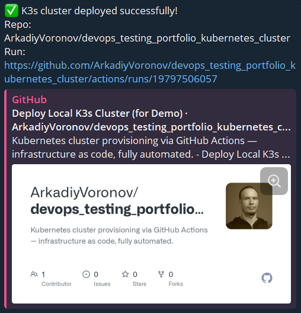

# 🚀 DevOps Testing Portfolio: Automated Kubernetes Cluster Deployment via GitHub Actions

This repository demonstrates a fully automated **single-node Kubernetes cluster (K3s) deployment** directly inside a GitHub Actions runner, followed by **health checks and real-time notifications** to Telegram.

> ⚠️ **Note**: The cluster runs inside the ephemeral GitHub Actions runner and is **destroyed after the workflow ends**. This is intended for **demonstration, testing, and DevOps portfolio purposes only** — not for production workloads.

---

## ✨ Features

✅ Deploys K3s + kubectl in under 20 seconds  
✅ Deploys a test `nginx` application  
✅ Runs health checks (nodes, pods, HTTP connectivity)  
✅ Saves encrypted `kubeconfig` as an artifact  
✅ Sends **real-time status notifications to Telegram** on success/failure  

---

## 📬 Telegram Notifications

Upon completion, the workflow sends a message to your Telegram channel or chat with:
- Workflow status (✅ Success / ❌ Failure)
- Repository name and branch
- Link to the run
- A preview card with repo info

### 📸 Example Notification



> *Screenshot of actual notification received in Telegram*

---

## 🛠️ How to Set Up

### 1. Secrets (required)
In your repository: **Settings → Secrets and variables → Actions**

Add these secrets:
- `TG_BOT_TOKEN` — your Telegram bot token (from [@BotFather](https://t.me/BotFather))
- `TG_CHAT_ID` — your chat ID (get it via `https://api.telegram.org/bot<TOKEN>/getUpdates`)
- `KUBECONFIG_PASSPHRASE` — password to encrypt kubeconfig (optional, but recommended)

> 💡 For `chat_id`: if you're sending to a **group**, use negative ID like `-1001234567890`. For **private chat**, use positive ID like `987654321`.

### 2. Trigger the Workflow
- Push to `main` branch
- Or trigger manually: **Actions → Deploy Local K3s Cluster (for Demo) → Run workflow**

---

## 📁 Artifacts

After each run, you can download:
- `local-kubeconfig.gpg` — encrypted Kubernetes config (decrypt with your passphrase)

To decrypt locally:
```bash
gpg --decrypt local-kubeconfig.gpg > ~/.kube/config
